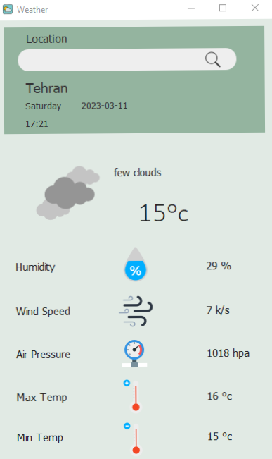

# Waether api
Request the weather data of cities from https://openweathermap.org/

## Description
Using lat and lon of each city and timezonefinder, we get the time zone:

``` python

from timezonefinder import TimezoneFinder

tf = TimezoneFinder()  

query_points = [(51.4215, 35.6944), ...]
for lng, lat in query_points:
    tz = tf.timezone_at(lng=lng, lat=lat)  # 'Asia/Tehran'

```

Using timezone and datetime, we get the time and date:

``` python
from datetime import datetime
import pytz

datetime_in_Tehran = datetime.now(pytz.timezone('Asia/Tehran'))

print(datetime_in_Tehran)
# 2023-03-12 15:35:18.904024+03:30
```

### Requirements
+ python 3.9
+ pyqt5
+ datetime
+ timezonefinder
+ pytz

### Usage
First, install the required packages and create an account on the https://openweathermap.org/ and get an API key and write it in the url, and now is ready to run...

